### Sobre mi

Estudiante de Ingenieria en Tecnologia de Software en la Facultad de Ingenieria Mecanica y Electrica (FIME), Nuevo Leon, Mexico. Aprendiendo desarrollo fullstack con el stack de JavaScript/TypeScript de forma constante y disciplinada. Construyendo proyectos reales mientras avanzo en mi plan de estudios.

- Actualmente trabajando con: **TypeScript**, fundamentos de **Bash/terminal** y **Git**
- Aprendiendo a fondo antes de pasar al siguiente tema
- Objetivo: practicas profesionales como desarrollador fullstack

---

### Roadmap de aprendizaje

> Tecnologias que estoy aprendiendo esta semana (Semana 1: fundamentos de programacion, editor y terminal).

---

### Proyectos

| Proyecto | Descripcion | Tecnologias |
|---|---|---|
| CashMind | App movil de finanzas personales enfocada en gestion de deudas y ahorro, con un algoritmo de optimizacion para priorizar el pago de tarjetas de credito segun su tasa de interes | React Native, Expo, JavaScript |
| [Plan de Estudio Fullstack](https://ardoultra.github.io/plan-estudio/) | Calendario interactivo de 20 semanas con tracking de progreso, vocabulario y diario de estudio | HTML, CSS, JavaScript |

> Mas proyectos en camino conforme avanzo en mi formacion.

---

### Estadisticas

---

Estudiante de ITS en FIME | En camino a fullstack developer

